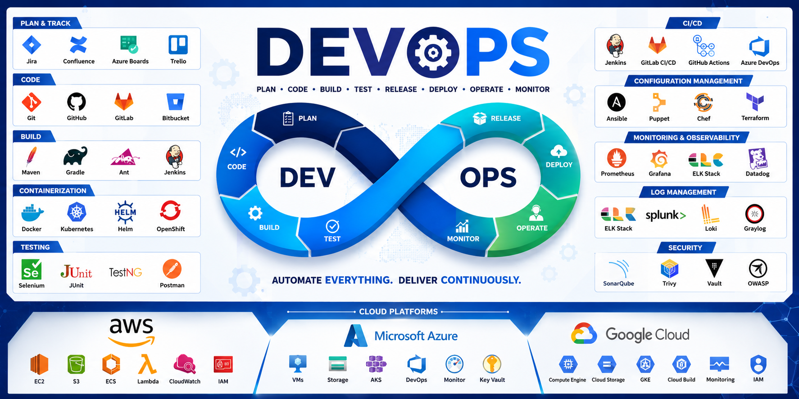

  

  

<h1 align="center">Hi 👋, I'm Mayur Khobragade</h1>
<h3 align="center">DevOps Engineer | AWS | Docker | Kubernetes | Terraform | Jenkins</h3>

---

## 🚀 About Me

- DevOps Engineer with hands-on experience in CI/CD, Cloud Infrastructure, and Automation
- Skilled in AWS, Docker, Kubernetes, Terraform, Jenkins, Linux, and Shell Scripting
- Passionate about Infrastructure Automation and Cloud Technologies
- Experience working on deployment automation and troubleshooting production issues

---

## 🛠️ Skills

### Cloud Platforms
- AWS (EC2, IAM, S3, VPC, CloudWatch)

### DevOps Tools
- Jenkins
- Docker
- Kubernetes
- Terraform
- Git & GitHub

### Operating Systems
- Linux (Ubuntu, CentOS)

### Scripting
- Shell Scripting (Bash)

---

## 📌 DevOps Projects

| Project | Description |
|----------|-------------|
| Jenkins CI/CD Pipeline | Automated build and deployment pipeline using Jenkins |
| Dockerized Application | Containerized web application using Docker |
| Kubernetes Deployment | Application deployment using Kubernetes manifests |
| Terraform AWS Infrastructure | Automated AWS Infrastructure using Terraform |
| Linux Automation Scripts | Shell scripts for server automation and monitoring |

---

## 🔥 DevOps Tools & Technologies

---

## 📊 GitHub Stats

---

I love automating infrastructure and building scalable cloud solutions.
